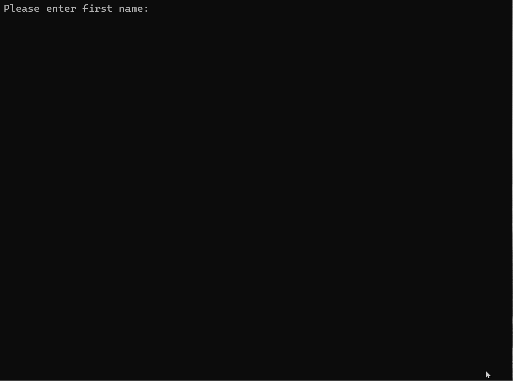

# Winter 2026 Assignment 04 - Working with Custom Objects
__Weight:__ 20% of final mark

__Submission requirements:__ On or before the deadline, commit a Visual Studio 2022 project to the GitHub repository. __You must commit and push to the classroom repository supplied for the assignment__; do not create your own repository. It is your responsibility to ensure that your work is in the correct repository. ___Work not in the repository will not be graded___.

## Context
A friend of yours is starting a retail storefront selling print products. As part of their business operations, they need a simple system to help them store and track information about their customers. You've agreed to help them with a pilot project by creating a simple console application that will allow them to enter new customers and display their customer details. As time goes on, additional functionality can be added to the application.

## Requirements

The program build will be developed in two parts:

### Part A – Class and Object Implementation

<u>Customer Class</u>

Design a class named `Customer` that meets the following  requirements:

- A `string` field to store the customer's first name and a corresponding property `FirstName` with both `get` and `set` functionality.
  - This field cannot be empty, null, or whitespace. Ensure that the stored value is trimmed of leading and trailing whitespace.
- A `string` field to store the customer's last name and a corresponding property `LastName` with both `get` and `set` functionality.
  - The description cannot be empty, null, or whitespace. Ensure that the stored value is trimmed of leading and trailing whitespace.
- An `int` field to store the number of orders this customer has made and a corresponding property `OrderCount` with both `get` and `set` functionality.
  - The count must be greater than zero.
- A `double` field to store the total order cost and a corresponding property `TotalSales` with both `get` and `set` functionality.
  - The price must be greater or equal to zero.
- A [greedy constructor](https://dagilleland.hashnode.dev/greedy-constructors)  that requires the first name, last name, order count, and total sales as parameters.
  - Use the properties in the constructor for setting the fields to take advantage of any validation checks already coded.
- A read-only property named `AverageOrder` that will return as a `double` the average value of that customer's orders.
  - To calculate the average value per order, the formula is 
    <code>average value = total sales / # of orders</code>
- A read-only property named `CustomerTier` that will return as a `string` the frequent customer tier to which the customer belongs.

  | # Orders      | Tier   |
  | ------------- | ------ |
  | Fewer than 10 | Bronze |
  | 10 - 49       | Silver |
  | 50 or more    | Gold   |

- A read-only property named `FullName` that will return as a `string` the customer's full name in the format `LastName,FirstName`.
- Challenge (not for marks): Override the `ToString()` method to output `LastName,FirstName,OrderCount,TotalSales`.


Write a program to test your `Customer` class as shown in the sample run below. The program must, at a minimum, demonstrate the following:

- a. prompt for a `string`
- b. prompt for an `int`
- c. prompt for a `double`
- d. create an instance of `Customer` from user input
- d. display the average order or customer tier, depending on user request, along with full customer name, order count, and total sales.
- f. have appropriate error handling (i.e. the program must not crash)

#### Sample Program Run (Part A implementation)
_NOTE: the sample run does not demonstrate exception handling, ensure your program handles exceptions gracefully and does not crash._

#### Successful run


#### Validation run



### Part B - Customer List and Menu-Driven Program Implementation

Improve on the program developed in Part A by adding the following features (_NOTE: this is not a new program, update the program from Part A to be a more robust and functional program._):

- The program should make use of file storage (specifically, a CSV file) to store Customers.
- The ordering of fields for the CSV file is up to you, and the file must be in an acceptable CSV format.
- When the program begins, load each customer from the file as a `Customer` object and store them in a `List`. 
- Any customers added to the program must be added to the list of customers.
- Any customers removed from the program must be removed from the list of customers.
- When the program ends, write the `List` of customers to the file.

Stretch Goals [Optional]
- Keep the list/file sorted in alphabetical order by customer last name.

In addition to the existing functionality in the program (add customer, edit customer, view customer details, and quit), add menu options for the following:
- Allow the user to view all customers in the system.
- Allow the user to search for an existing customer, by first or last name (e.g. searching for 'mar' would return all customers with that substring in their first or last name).
- Allow the user to remove customers.

An example of what your main menu could look like is as follows:
```
Display Customers
Search Customers
Add New Customer
Edit Customer
Remove Customer
View Customer Details
Quit
```

You must use a modular approach to your solution, utilize previous work and in-class examples to help with this task.

Think carefully about how you will structure this program and consider the user experience when implementing it.

#### Successful run

___There are no sample program runs for Part B, you're on your own.___

## Coding Requirements
__NOTE:__ the following requirements are expected and you will not receive corrective feedback prior to the submission deadline if any of the following are unmet.

- A C# comment block at the beginning of the source file describing the purpose, author, and last modified date of the program.
- Write only one statement per line.
- You must use a `List` for storing Customers in your solution.
- Use camelCase for local variable names.
- Use UPPER_SNAKE_CASE for constant variable names.
- Use defensive programming where necessary, including input validation on all user inputs.
- Ensure graceful handling of exceptions.
- Include summary comments for all defined methods.


## 🎠 Submission
Commit and push your solution as per your instructor's direction, on or before the due date. Ensure that your solution follows the best coding and style practices, as your instructor has shown you in class. Failed adherence to the prescribed style guidelines may result in lost marks. __Your program must compile; a program that fails to compile will not be graded.__

_NOTE: submit early and often to receive feedback from your instructor prior to the due date. Your instructor will not be providing feedback for every commit every day. However, the earlier and more often you commit, the greater the chances of your instructor reviewing your work and providing constructive feedback that you can act on before the due date._

## Rubric [30 Marks Total]

### Part A [12 Marks - Class and Object Implementation]

| Criteria |  Good (3 marks) | Acceptable (2 marks) | Needs Work (1 mark) | Unsatisfactory (0 marks)
|-|-|-|-|-|
| Fields & Properties | All fields & properties are created with the expected visibility, data type, and validation. | 1-2 minor errors in fields & properties. | Missing fields, validation, or other significant errors. | Fewer than half of the fields/properties were created. |
| Methods | Constructors & methods created as specified. | 1-2 minor errors in methods. | Validators do not use existing validation checks, missing constructor/method, or other significatnt errors. | No methods were written. |
| Part A Program | Program prompts for `string`, `int`, `double`, creates an instance, and allows the user to choose to display average order or customer tier, without crashing. | 1-2 missed requirements. | At least half of these tasks were complete. | Fewer than half can be directly tested. |
| Part A Testing | Program passes all test cases. | Program passes more than half of the test cases. | Program passes fewer than half of the test cases. | Program does not pass any tests. |


### Part B [12 Marks - Extended Program Completion]
| Criteria |  Good (3 marks) | Acceptable (2 marks) | Needs Work (1 mark) | Unsatisfactory (0 marks)
|-|-|-|-|-|
|File I/O|Read/write as per program specs, acceptable file format was used, defensive programming was implemented and program does not crash, and sample test file provided. |Minor errors in file format, program crashes during file I/O in some cases, or missing sample file.|Significant issues with file format, or defensive programming is not applied.|Errors during file I/O crash program, required format isn't implemented, or code not written.|
| `List` | `List` is correctly written to and updated throughout program run, including adding, editing, and removing elements. | 1-2 minor errors. | Significant errors in `List` implementation. | Lists are not implemented, or unable to add, remove, and edit elements. |
| Part B Functionality | User can view customer details, view all customers, and search for a specific customer.  Menu-driven program which loops until the user chooses to exit. | 1-2 minor errors. | Significant errors or missing functionality. | Functionality is not attempted. |
| Part B Testing | All tests pass. | Most tests pass. | Some tests pass. | No tests pass.

### Documentation & Best Practices [6 marks]
| Criteria |  Good (3 marks) | Acceptable (2 marks) | Needs Work (1 mark) | Unsatisfactory (0 marks)
|-|-|-|-|-|
| Documentation |All methods correctly & fully documented in XML format.|Most methods are documented.|Fewer than half of methods are documented.|Documentation is not completed.|
| Best practices | Code follows course best practices including good naming conventions, properly aligned output, opening comment block, appropriate use of comments, and minimizes redundant code. | 1-2 minor errors or violations. | 3+ errors or standard violations. | No alignment, documentation, or appropriate names.
